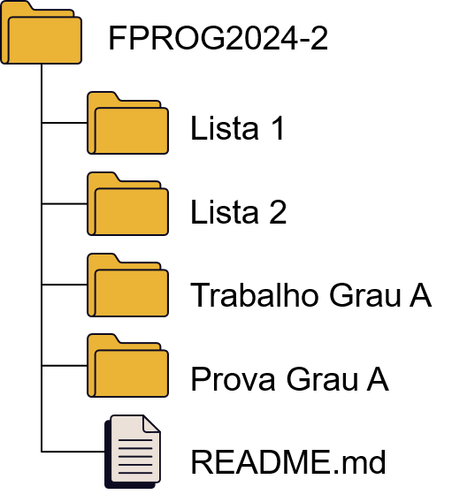
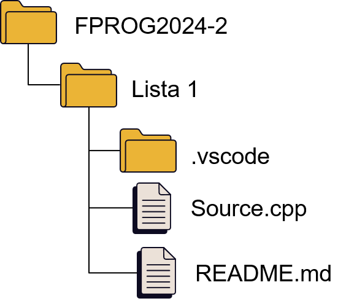

# Animação Computadorizada 2024/2

Professora: Rossana B Queiroz

Este é o repositório de exemplos para as atividades da Atividade Acadêmica Animação Computadorizada do curso de graduação em Jogos Digitais da Unisinos.

Para a entrega dos exercícios, recomenda-se a criação de um repositório no Github (ou similar) e seguir a seguinte estrutura:

Ou seja, um repositório para a Atividade Acadêmica (disciplina) e cada tarefa em um diretório separado (projeto).
No diretório de cada projeto, além do(s) código(s) fonte, recomenda-se criar um arquivo README.md, conforme este template:
- [Template para o README.md dos projetos](TemplateREADME.md)

## Links úteis
- [Template para o README.md dos projetos](TemplateREADME.md)
